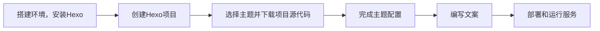

本站为基于Hexo框架建立的静态网站。

# Hexo 官方资源

- 官方网站：[Hexo](https://hexo.io/)
- 官方文档：[documentation](https://hexo.io/docs/)
- 故障排除：[troubleshooting](https://hexo.io/docs/troubleshooting.html)
- <i class="fab fa-github"></i>： [GitHub](https://github.com/hexojs/hexo/issues)

# 建站流程



## 环境搭建
> 注：本文开发环境建立在“适用于Linux的Windows子系统”（WSL）上，使用的发行版为Ubuntu 22.04 LTS。

1. 安装Node.js
2. 使用npm安装hexo-cli
3. 安装Git

## 项目构建
1. 创建项目目录，在该目录上创建hexo项目

```bash
hexo init
```

2. 选择合适的Hexo主题，访问对应的GitHub项目源代码，克隆到目录`./themes/<themes_name>` 

```bash
git clone <xxx.git> themes/<theme_name>/
```

3. 分别编辑 `_config.yml` 和 `./themes/<themes_name>/_config.yml` 文件，对网站基本组件和主题组件进行配置

4. 创建新页面和新文章，使用Markdown编写内容

创建新页面
``` bash
hexo new page "My New Page"
```

创建新文章
``` bash
hexo new post "My New Post"
```

了解更多: [Writing](https://hexo.io/docs/writing.html)

5. 运行服务

``` bash
hexo server
```
服务成功运行后，可在 localhost 访问本站

了解更多：[Server](https://hexo.io/docs/server.html)

6. 生成网站静态文件（html，css，js和图片）

``` bash
hexo generate
```

运行后会生成静态文件在项目 `./public` 目录中。

更多信息：[Generating](https://hexo.io/docs/generating.html)

7. 部署网站

hexo 提供了一种部署方案，你也可以通过其他方式部署，各大云服务提供商都给出了详细教程
``` bash
$ hexo deploy
```

了解更多: [Deployment](https://hexo.io/docs/one-command-deployment.html)
